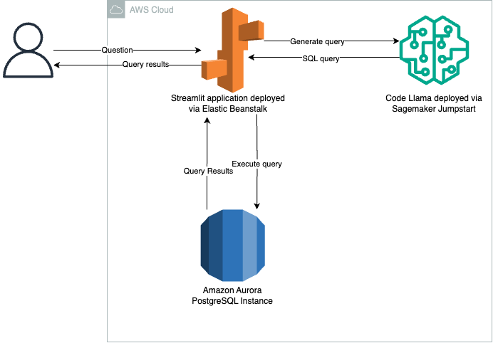

# text-to-sql-demo

This Generative AI demo lets you query structured data from RDS with natural language. You can now easily consume your data without any knowledge of SQL in a chat like manner, without the necessity of specifically made dashboards. Not only does our demo create data specific SQL queries, but we have also attached a demo database to run your queries against and test it out. Give it a try with our pre-configured examples!

## Overview  
In this Lab we will explore how to build a Generative AI powered application to query structured data from Amazon Relational Database Service using natural language on AWS.          
We deploy a language model through Sagemaker Jumpstart and use the Langchain framework for prompting. 
Navigate to `text2sql.ipynb` for a step by step guide on building this application.

### Sagemaker Jumpstart Model Used
We leverage Code Llama by Meta AI - deployed on an `ml.g5.2xlarge` instance
We use this model for Natural Language to SQL generation with the help of proper prompt engineering techniques.

Your key learnings will be:

* Deploying the Code Llama 7B model using SageMaker Jumpstart
* Learning to interact with our model using the SageMaker SDK
* Using LangChains `PromptTemplate` module to define our prompt template, which includes table information and few shot examples.
* Exploring LangChains `create_sql_query_chain` module, to generate an SQL query
* Connecting all these components including the execution of the query on our database

### Code Notebook for the Lab
Let's run the code in `natural-language-to-sql.ipynb` notebook for this lab. This notebook can be found in the folder titled `/usecases/text-to-sql` in the `amazon-sagemaker-generativeai` repository that we just cloned.
